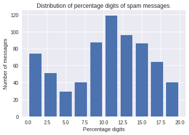
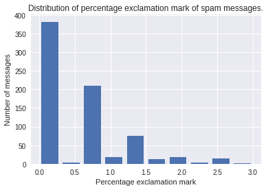
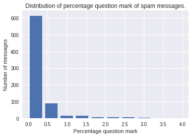
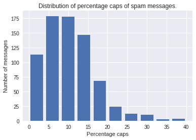
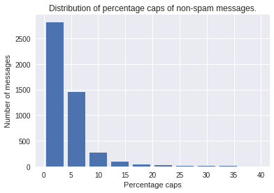
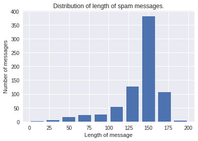
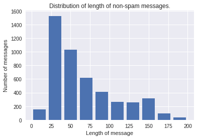

# Spam-classifier
A classifier which can classify that sms is spam or not with 95% accuracy

Using self implemented Naive Bayes Classifier. Using TF_IDF for calculating probability whether a word is ham/spam gave much better results compared to calculating probability normally. 

Spam classifier is a model which helps in distinguish between spam and non-spam messages. This model helps user to delete the unwanted messages that are marked as spam.The model used for this is logistic regression which used to read the messages and if features related to spam are found it then marked it as spam.

##Plots##

